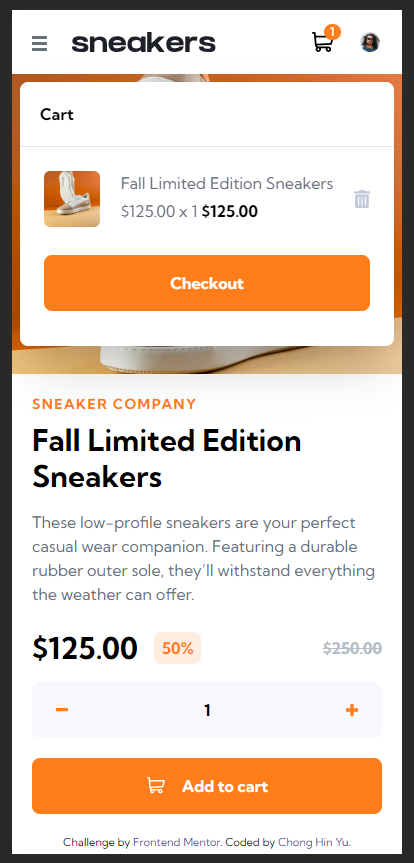

# Frontend Mentor - E-commerce product page solution

This is a solution to the [E-commerce product page challenge on Frontend Mentor](https://www.frontendmentor.io/challenges/ecommerce-product-page-UPsZ9MJp6). Frontend Mentor challenges help you improve your coding skills by building realistic projects.

## Overview

Completed the E-commerce product page using React,Tailwind CSS, React-Burger-Menu library and React-Image Gallery library.

I used Flex to layout the page and was created with mobile-first approach.

The navbar menu changes based on the screen size, so you will have a burger menu on mobile and the standard nav bar menu on desktop.

The image gallery with thumbnails and image lightbox is a feature for the desktop layout.

The cart will appear over the image gallery on mobile layout, while on desktop the cart will appear just under the cart icon in the header.

### The challenge

Users should be able to:

- View the optimal layout for the site depending on their device's screen size
- See hover states for all interactive elements on the page
- Open a lightbox gallery by clicking on the large product image
- Switch the large product image by clicking on the small thumbnail images
- Add items to the cart
- View the cart and remove items from it

### Screenshot

Mobile
 

Mobile menu open
 

Mobile cart empty
 

Mobile cart item
 

Desktop
 

Desktop cart empty
 

Desktop cart item
 

Desktop lightbox
 

### Links

- Live Site URL: [E-commerce product page](https://hin274.github.io/ecommerce-product-page-main/)

## Author

- Frontend Mentor - [@hin274](https://www.frontendmentor.io/profile/Hin274)
